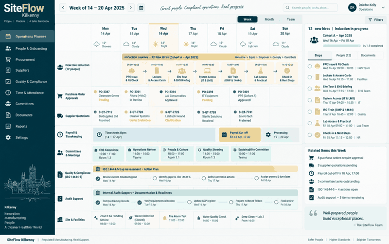

# SiteFlow — Business Support Operations

A site-support planner covering induction, procurement and payroll controls.



## What this repository demonstrates

- Role-based induction checklists
- Purchase-order approval routing
- Payroll submission completeness checks

## Run locally

```bash
python -m src.app
python -m pytest
```

The interface prototype is available at `docs/dashboard.html`.

## Data and integrity note

All people, companies, cases, metrics and operational records shown here are synthetic demonstration data. This independent portfolio project demonstrates engineering and analytical capability; it does not claim that the system was deployed for an employer or client.

## Engineering practices

- Domain logic separated into testable functions
- Automated tests executed through GitHub Actions
- Reproducible standard-library implementation
- Docker entry point for consistent execution
- Documentation of architecture and assumptions
